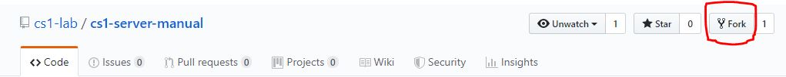

# 自身のPCでマニュアルを執筆できるようにする

CS1サーバマニュアルはGit/GitHubを使い管理しています。
このマニュアルでは、それらの使い方は最低限しか説明しませんので、Gitに関する知識は適宜身に着けてください。

**GitHubアカウントを持っている前提で進めます**  
[GitHub.com](https://github.com/)  

## マニュアルをFork

自分のアカウントでログインします。**cs1-serverのアカウントでログインしてはいけません**  
このマニュアルのリポジトリへいきます。
[cs1-lab/cs1-server-manual](https://github.com/cs1-lab/cs1-server-manual)  

Forkします


Forkできたら、自身のアカウントに`cs1-server-manual`のリポジトリが追加されるはずです。

## マニュアルをリポジトリからクローンする

Forkしたリポジトリを適当なディレクトリにクローンしま。

```shell-session
$ git clone https://github.com/あなたのユーザ名/cs1-server-manual.git
```

確認してみましょう。

```shell-session
$ ls 
cs1-server-manual 
$ cd cs1-server-manual/ 
$ ls 
centos-preparation  dynamic-webserver  gitbook-preparation  outline  README.md  server-preparation  SUMMARY.md 
```

上記のファイル内容は、このマニュアル作成時のものですので変わる場合があります。  
これで執筆が可能となります。

## エディタを用意する

マニュアルを執筆するためには、Markdownの書けるエディタが必要です。  
また、文字コードはUTF-8を設定できるものを利用しましょう。  
参考までに名前を載せておきますので適宜調べてください。
- Atom
- VSCode
- Vim

## gitbookなどの依存関係をインストールする

```shell-session
$ cd cs1-server-manual
$ npm install
```

本マニュアルでは、` package.json ` を設定しています。依存関係にあるパッケージは自動的にインストールされます。
インストールされる代表的なパッケージを説明します。

### GitBook

[GitBook](https://github.com/GitbookIO/gitbook)  
本マニュアルはGitBookを利用することを前提に書かれています。

### textlint

[textlint](https://github.com/textlint/textlint)  
textlintにより表記ゆれや日本語の不自然な箇所を指摘・修正します。  
` .textlintrc ` に詳しい設定が記述されています。

```shell-session
$ textlint ファイル名
```

また、alias（`package.json`に記述）を設定しているため以下を実行することですべてのドキュメントを確認できます。

```shell-session
$ yarn textlint
# npm runでも構いません
$ npm run textlint
```

変更を加えていなければ特に問題なく終了するはずです。
もし問題があれば、以下で自動修正することもできます。

```shell-session
$ yarn textlintFix ファイル名
# npmでも構いません
$ npm run textlintFix ファイル名
# 再帰的に処理する場合
$ yarn textlintFix **/*.md
```

このようにしてドキュメントを編集した場合は確認しましょう。

### remarklint

[remarklint](https://github.com/remarkjs/remark-lint)  
textlintによりMarkdown自体のフォーマットを検証します。  
` .remarkrc ` に詳しい設定が記述されています。

```shell-session
$ remarklint ファイル名
```

また、alias（`package.json`に記述）を設定しているため以下を実行することですべてのドキュメントを確認できます。

```shell-session
$ yarn remarklint
# npm runでも構いません
$ npm run remarklint
```

変更を加えていなければ特に問題なく終了するはずです。
このようにしてドキュメントを編集した場合は確認しましょう。

## 執筆する

**GitBookではブラウザで完成イメージを見ながら執筆できます。**

```shell-session
$ cd cs1-server-manual
$ gitbook serve
gitbook serve 
Live reload server started on port: 35729 
Press CTRL+C to quit ...

info: 7 plugins are installed  
info: loading plugin "livereload"... OK
info: loading plugin "highlight"... OK  
info: loading plugin "search"... OK
info: loading plugin "lunr"... OK  
info: loading plugin "sharing"... OK  
info: loading plugin "fontsettings"... OK
info: loading plugin "theme-default"... OK
info: found 12 pages  
info: found 5 asset files
info: >> generation finished with success in 1.3s !  

Starting server ...
Serving book on http://localhost:4000
```

ブラウザで` http://localhost:4000 `にアクセスすると、完成イメージが見られます。
また、ファイルを変更した際には自動的に内容が更新されますので、
ターミナルを複数開きずっと起動させておくとリアルタイムで変更を確認できるので便利です。

また、**サーバで公開（ビルド）するのも簡単です。**

```shell-session
$ gitbook build 
info: 7 plugins are installed  
info: 6 explicitly listed
info: loading plugin "highlight"... OK  
info: loading plugin "search"... OK
info: loading plugin "lunr"... OK  
info: loading plugin "sharing"... OK  
info: loading plugin "fontsettings"... OK
info: loading plugin "theme-default"... OK
info: found 12 pages  
info: found 5 asset files
info: >> generation finished with success in 1.2s !  
$ ls 
_book  centos-preparation  dynamic-webserver  gitbook-preparation  outline  README.md  server-preparation  SUMMARY.md　　
```

`_book`ディレクトリができます。

```shell-session
$ cd _book
$ ls
centos-preparation  dynamic-webserver  gitbook  gitbook-preparation  index.html  outline  search_index.json  server-preparation
```

` index.html ` がありますので、これをそのままサーバに上げることで静的なサイトとして公開できます。

## 執筆した部分のPull Requestを出す

ここまで、皆さんのPCで執筆できるようになりました。  
それを研究室の遺産として残すにはどのようにすればよいかを説明します。  
(つまり、[cs1-lab/cs1-server-manual](https://github.com/cs1-lab/cs1-server-manual)
に変更が取り込まれないと意味がありません。)

しかし、ここではその説明は省きます。次のようなキーワードで検索してみてください。
- GitHub pullrequest 方法
- GitHub pr 方法
- GitHub pr 投げ方

Pull Requestを出す方法が分かったとして、以下はこのマニュアルを執筆する上での注意点です。
- コミットはこまめに、分かりやすく行いましょう
- コミットメッセージに形式はありませんが、過去のものを参照するなどして、形式を合わせましょう
- Pull Requestにテンプレートはありませんが、過去のものを参照して、形式を合わせましょう

## 分からないことがある

このマニュアルを読んでいるということは、サーバ管理の担当の方だと考えます。  
マニュアルは後世のためにも非常に重要です。
不明な点はSlackでお気軽に聞いてください!
